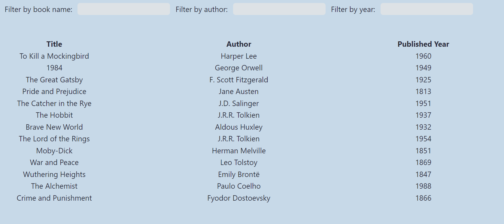

# filtering-items

## Description
This is simple programm that contain small list of books with authors and years of publishing. You can find any book from this list depends on name, author's name and year of publishing. The propose of this project is to make some simple word and number filters. Here is the screenshot of the project: 

<div align="center">

</div>

### Structure
## HTML
```html
<body>
    <main>
        <div class="container">
            <label for="book-name-filter-input" class="item">Filter by book name:</label>
            <input type="text" class="book-name-filter-input item">
            <label for="author-filter-input" class="item">Filter by author:</label>
            <input type="text" class="author-filter-input item">
            <label for="year-filter-input" class="item">Filter by year:</label>
            <input type="text" class="year-filter-input item">
            <table>
                <thead>
                    <tr>
                        <th>Title</th>
                        <th>Author</th>
                        <th>Published Year</th>
                    </tr>
                </thead>
                <tbody class="table-of-books">
                </tbody>
            </table>
        </div>
    </main>
</body>
```

### Demo
You can try this programm [here](https://maksimdimov.github.io/filtering-items/).
